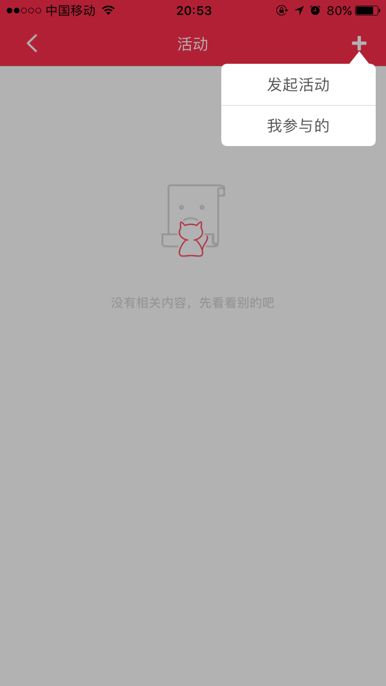

# ZYAlertView
<pre><code>
//按钮点击事件
-(void) _buttonOptionPressed:(UIButton *)optionButton{ 
	//convertRect: toView 获取到屏幕上该控件的绝对位置。 
	UIWindow * window = [[UIApplication sharedApplication].delegate window];  
	CGRect frame = [optionButton convertRect:optionButton.bounds toView:window]; 
	ZYAlertMessageView *alertView = [[ZYAlertMessageView alloc] initWithFrame:CGRectMake(self.view.bounds.origin.x,self.view.bounds.origin.y, self.view.bounds.size.width,self.view.bounds.size.height+64)];//self.view.bounds 
	//标题数组 
	alertView.option_optionContents = @[@"发起活动",@"我参与的"]; 
	//图片数组 
	//alertView.option_optionImages = @[@"image1",@"image2"]; 
	//使用链式语法直接展示 无需再写 [alertView option_show]; 
	[[alertView option_setupPopOption:^(NSInteger index, NSString *content) { 
	//点击回调 
	NSLog(@"你选中了第%ld行 %@", index, content); 
	SearchFriendViewController *search = [[SearchFriendViewController 	alloc]init]; 
	[self.navigationController pushViewController:search animated:YES]; 
	} whichFrame:frame animate:YES] option_show]; 
	} 
</code></pre>

